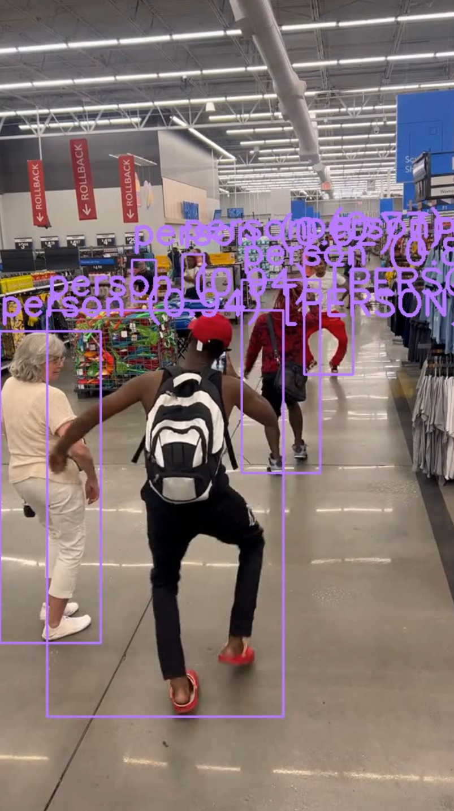
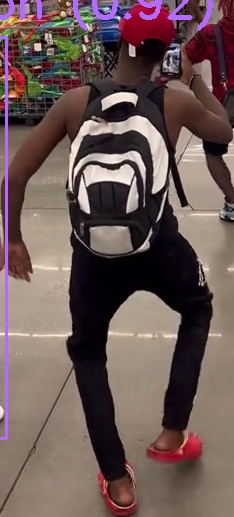
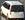

# CCTV Detection Program for Korea Road Traffic Corporation

## Project Name
Korea Road Traffic Corporation CCTV Detection Program

## Project Result (Example)

| Origin Image   | Detected by YOLO   | Detailed Analysis via VLM  | 
|---------------|-------------------|----------------------------|
|  |  |  <br> The person appears to be shopping or browsing through a store, possibly looking at items on shelves or displays. |
|     |    |  <br> The vehicle type of this car is a VAN.      |


## Objective
- The goal of this project is to detect various emergency situations in real-time, such as people, stationary vehicles, fallen objects, and moving objects, based on CCTV video footage of roads.
- Additionally, the system not only detects objects but also analyzes their specific status to provide a more detailed understanding of the situation.

## Methodology
- **Object Detection**: The initial object detection is performed using YOLO, which identifies various objects in the CCTV video.
- **Status Detection**: After detecting the objects, the VLM (Visual Language Model) is used to assess the specific status of each object.
- **Data Processing and Event Detection**: The processed data is then finalized, and the identified event is transmitted to Kafka for further use and analysis.

## Key Features
- Real-time object detection from CCTV footage
- Detection of emergency situations such as people, stationary vehicles, and moving objects
- YOLO detects objects quickly on a per-frame basis.
- If further analysis of detected objects is required, an API calls the VLM (deployed within a container) to retrieve detailed metadata about the object's status.
- Integration with Kafka for event transmission and processing
  
## Model Used
- [llama3.2-vision](https://ollama.com/library/llama3.2-vision)
- [Ultralytics YOLO11.pt](https://docs.ultralytics.com/models/yolo11/)

## How to Run code
To set up this project, clone the repository:

```bash
sudo docker run -it --gpus all --shm-size=128g -p 8505:8888
```

This command will:

- Use all available GPUs (`--gpus all`).
- Allocate 128GB of shared memory (`--shm-size=128g`).
- Expose port `8505` for access to the Jupyter Notebook interface.
- Mount the local `/home/smartride/DrFirst` directory to `/app` in the container for seamless file access.

### 3. Access Jupyter Notebook

Once the container is running, open a web browser and navigate to:

http://{your_IP}:8505

This will give you access to the Jupyter Notebook interface, where you can run the detection scripts.

### 4. Usage

1. Prepare your CCTV footage data.  
   - The input data can be either an **MP4 video file** or a **real-time streaming source** in the format:  
     `rtsp://<your-stream-url>.stream`

2. Run the object detection script:

```bash
# for streaming
python /app/yolo_structure/src/yolo_fast_stream.py

# for video file
python /app/yolo_structure/src/yolo_fast_save.py
```

3. The final processed event will be transmitted to Kafka.
